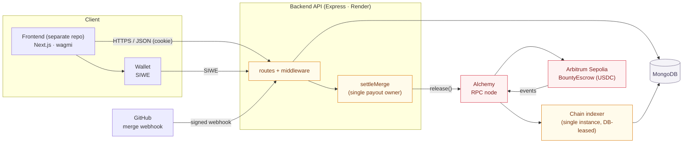
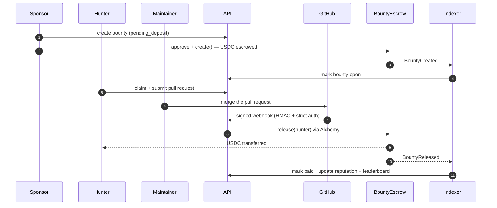

<div align="center">

# DevBounty — Backend

**A decentralized bug-bounty platform.**
USDC-collateralised. Self-custodial escrow. Paid automatically on merge. Built for Arbitrum.

[](LICENSE)
[](api/)
[](api/)
[](api/)
[](contracts/)
[](contracts/)
[](#status)
[](#testing)
[](#status)

</div>

---

## What it is

DevBounty lets a project owner put real money behind a bug report without trusting a middleman.
A sponsor funds a bounty in **USDC** held by an on-chain escrow contract. A security researcher
("hunter") claims it, fixes the issue, and opens a pull request. When a maintainer merges that
pull request, GitHub notifies the backend, which verifies the merge and **releases the escrowed
USDC to the hunter on-chain**. Hunters build public reputation through profiles and a leaderboard.

The escrow is self-custodial: funds sit in `BountyEscrow` until released. The backend's key can
only _release to a hunter_ — it can never divert or refund — so a compromised key cannot steal
funds. The blockchain is the source of truth for money; the database is the source of truth for
workflow, and may lag the chain but never contradict it.

This repository is the **backend**: the Express API, the chain indexer, and the escrow contract.
The web frontend lives in a separate repository.

---

## Capabilities

- **Self-custodial escrow.** USDC stays in `BountyEscrow` until an authorized `release()` pays the
  hunter. Access is split on-chain — the backend can release, only the maintainer can refund.
- **Automatic payout on merge.** A GitHub merge webhook is HMAC-verified, then strictly
  authorized (merged into the default branch, in the bounty's repo, by the claiming hunter)
  before the on-chain release fires. A maintainer manual-release covers a missed webhook.
- **Wallet identity.** Sign-In-With-Ethereum (EIP-4361) login with full signature recovery and a
  one-time server-side nonce, plus GitHub account linking via OAuth with tokens encrypted at rest.
- **Sybil-resistant claims.** One GitHub identity per wallet, a per-wallet active-claim cap, and a
  re-claim cooldown — enforced atomically so the cap can never be exceeded.
- **Single-owner payout.** The `submitted → releasing` transition is atomic; only the one caller
  that performs it can pay, so a bounty can never be released twice.
- **Chain indexer.** A single-instance (DB-leased) poller mirrors `BountyCreated/Released/Refunded`
  into MongoDB; reputation is recomputed from an append-only ledger, so a replayed event can never
  double-count.
- **Hardened API.** Strict CORS + Origin CSRF check, per-IP and per-wallet rate limits, pinned-HS256
  JWT sessions, idempotency keys on writes, and structured logging with secret redaction.
- **Free-tier hostable.** The indexer can run as its own worker or co-host inside the API
  (`RUN_INDEXER_IN_PROCESS`) so the whole loop runs on a single free service.

---

## Status

What works today on testnet, and what stands between it and a live, real-money product.

| Capability                                                   | State                                | What it needs                          |
| ------------------------------------------------------------ | ------------------------------------ | -------------------------------------- |
| Full bounty lifecycle (create → fund → claim → submit → pay) | Works on Arbitrum Sepolia            | —                                      |
| Automatic on-merge payout                                    | Works (proven end-to-end on testnet) | —                                      |
| Quality gates (typecheck · lint · 152 tests)                 | Green                                | —                                      |
| Reachable on the internet                                    | Not deployed yet                     | Render (API) deploy + env + keep-alive |
| Handle real money                                            | Test USDC only                       | Mainnet deploy + real USDC             |
| Production key custody                                       | Env key on testnet                   | KMS/HSM signer before mainnet          |
| Security audit                                               | None                                 | External audit before real funds       |

---

## Tech stack

| Layer                | Stack                                                                |
| -------------------- | -------------------------------------------------------------------- |
| API                  | Node.js 20–22 · Express · TypeScript (ESM)                           |
| Validation / logging | zod · pino                                                           |
| Auth                 | SIWE (EIP-4361) · JWT (HS256) · AES-256-GCM token encryption at rest |
| Chain access         | viem (public + wallet clients)                                       |
| Database             | MongoDB (Mongoose)                                                   |
| Contracts            | Solidity 0.8 · OpenZeppelin · Hardhat                                |
| Target chain         | Arbitrum Sepolia (testnet)                                           |
| Tests                | Vitest · supertest · mongodb-memory-server                           |

---

## Architecture

An npm-workspaces monorepo: `api/` (Express API + chain indexer, layered as routes over a
framework-free `shared/` domain core) and `contracts/` (the Hardhat escrow). The API owns the
on-chain payout; a single indexer reads chain events and syncs the database.



### Payout lifecycle — one bounty, end to end



---

## Getting Started

Requires Node.js 20–22, MongoDB, and an Arbitrum Sepolia RPC URL.

```bash
npm install
cp api/.env.example api/.env        # fill in the values
npm -w @devbounty/api run dev       # start the API in watch mode
```

The escrow contract and on-chain payout activate once `ESCROW_ADDRESS` and a signer key are set;
without them the contract-independent API runs on its own.

## Testing

```bash
npm -w @devbounty/api run typecheck
npm -w @devbounty/api run lint
npm -w @devbounty/api run test       # 152 tests (Vitest + supertest + in-memory Mongo)
```

Contracts are tested separately with Hardhat (lifecycle, access control, reentrancy):

```bash
npm -w @devbounty/contracts run test
```

---

## License

[MIT](LICENSE) © 2026 ozpool
